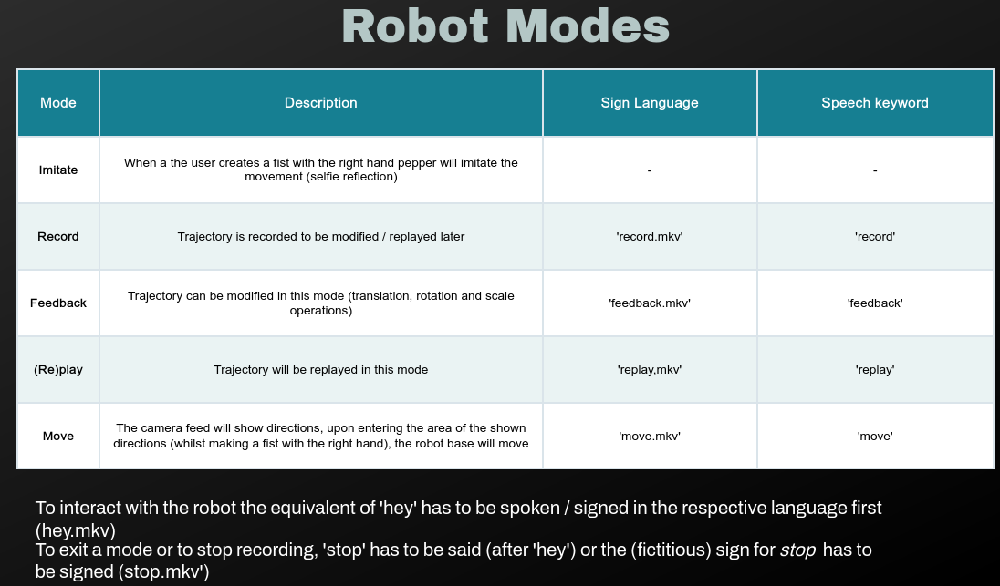
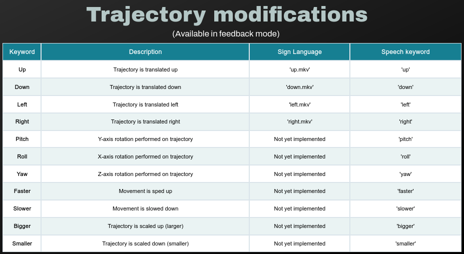

# nao-move: End-user programming of robot trajectories by using natural communication
## Description
This is a framework developed for a bachelor thesis at The Vrije University at Amsterdam. 

The goal of this project is to enable non-expert users to use natural communication (speech and sign language) to interact with and create robot trajectories (in simulation). 

This project draws inspiration from several sources: 
1. The framework implemented by a team from UT at Austin, which developeda framework to move a robot arm (in simulation) by getting input from a visual system.
From (2) and (3) code snippets were taken and modified to fit for respectively, static and dynamic hand sign classifications:
2. Static [Hand gesture recognition](https://github.com/kinivi/hand-gesture-recognition-mediapipe) library - which is a translation of a [repo](https://github.com/Kazuhito00/hand-gesture-recognition-using-mediapipe) which is in Japanese. To classify and train (static) hand gestures.
3. Dynamic [hand sign language recognition](https://github.com/nicknochnack/ActionDetectionforSignLanguage), to classify sign language and draw a probablity visualization.

## Installation
### Requirements / dependencies
- [ros2-foxy](https://docs.ros.org/en/foxy/Installation/Ubuntu-Install-Debians.html)
- tensorflow (`pip3 install tensorflow`)
- numpy (`pip3 install numpy`)
- pyaudio  (`sudo apt install portaudio19-dev python3-pyaudio` `pip3 install pyaudio` on Ubuntu 20.04)
- vosk (`pip3 install vosk`)
- pynput (`pip3 install pynput`)
- playsound (`pip3 install playsound`)
- [pyttsx3](https://pypi.org/project/pyttsx3/) On ubuntu 20.04, 
  - requires espeak: sudo apt install espeak
  - requires ffmpeg: sudo apt install ffmpeg

### Configuration
- Currently hardcoded to detect webcam from feed 0 (on linux: `/dev/video0`)
- Change this to your needs in the file `cvutils.py`
### Run
If the installation of all dependencies and ROS2 went well, you have to `cd` to the directory `/nao-move/dev_ws` and
run
- colcon build
- `ros2 launch robot_control robot_control.launch.py`.

#### How to interact

The sign language commands can be found [here](docs/flipped_demos).
  
Once in feedback mode, the following commands can be used to adjust the saved trajectory:

