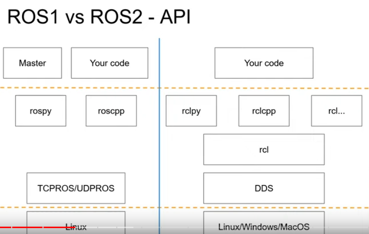

## Week 1
### Done this week
- Read and ran the ball tracker with pybullet arm simulation ([video](https://drive.google.com/file/d/1QnhcysKL1fhK-SB1o6wS4MHmiphN7qrs/view?usp=sharing))
- Experimented with PyBullet (and QiBullet).

### Problems / confusions
- There is no high level motions implemented in QiBullet (i.e, walking, arm motions etc). Although not all hope is lost as some Webot motion hacks were found in an repository which could help writing this functionality for Qi/Py-bullet simulation. Or should I just deal with Naoqi only (this would then only be possible in the lab)?.
- Are arm movements just with inverse kinematics?
- Don't really know what to have as a thesis outline, where will the bulk of text come from?

### Week 3
#### Questions
- Would like to use ROS2 instead. Some advantages:
  - **Python3** support (only Ros(1) Noetic supports python3) - pretty big since python2 is not supported anymore
  - Much better API layering 
    - One `rcl` library which interacts with each `rclpy` `rclcpp`, which provide the bindings to the `rcl` library. This means that the CPP and PY libraries are much more similar. Moreover, it will be easier to create new languages that interact with `rcl`

  
  - ROS2 will be the industry standard for ROS usage. It is conventionalized in many ways, from node structure to launch structure
  - Rosmaster is gone. Each node can talk to any other node without having to communicate through rosmaster first
  - ROS2 provides components: allows multiple nodes (called _components_) from a single executable
  - ROS2 has node life cycles 
#### What I've been doing
- Implemented voice recognition (using [VOSK](https://alphacephei.com/vosk/) library)
- Implemented gesture recognition (using [this](https://github.com/kinivi/hand-gesture-recognition-mediapipe) repo which uses a mediapipe + regression neural network for classification)
- Read articles _Eye-Hand Behavior in Human-Robot Shared Manipulation_, _Robot programming by Demonstration with Interactive Action Visualizations_
  - The latter is very relevant to what we're doing

### Week 4
#### Questions
- I do not really understand the arm configurations (see arm simulator package, file: `utils/simulator.py`). Where can I learn / understand these things better? How were they derived?
- What about playback speed?
- Voice recognition is quite weak when there is a conversation on the background...

#### What I've been doing
- Set up ROS2 implementation of the simulator
- Modularized code-base and tried to create a proper architecture for scaling later

### Week 5
#### What I've been doing
- Keyboard input for recording/saving/replaying
- Barebones pepper simulation using QiBullet
- Sound effects
#### Questions
- Pepper simulation (QiBullet): briefly played with it, it's not mimicking the movements correctly
- Speed of replay - currently using `sleep` and
#### Goals for next week
- Perfect sim 
  -(incl feedback:  perhaps a text to speech for feedback)
  - have feedback be looping (or x number of loops)
  - the correct boundaries of the sim (feedback when OOB movement?)
  - see if speed can be timestamped
- Set up experiment with sim
Later:
- depth
- less CPU expensive set up on the sim?
- demo on the real bot (next week)
